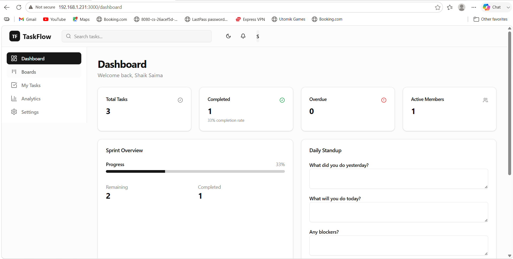
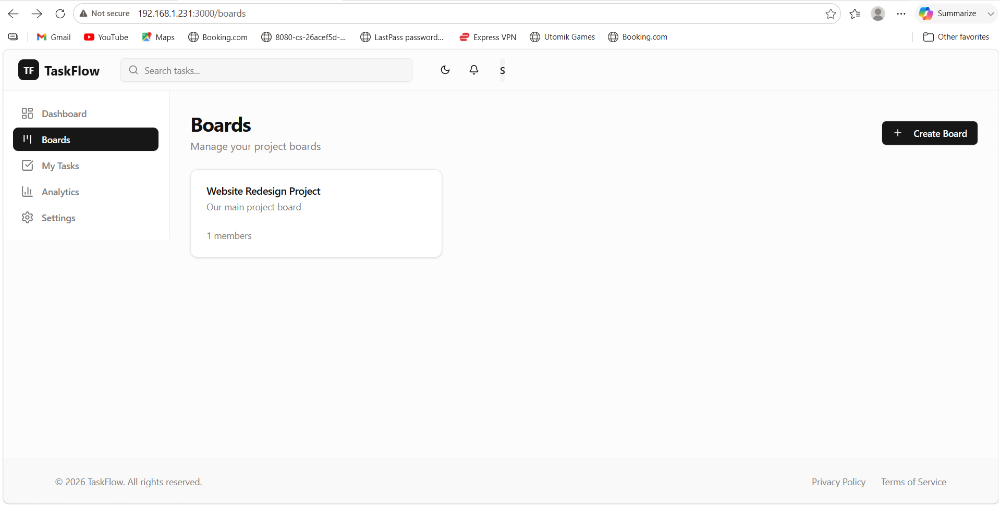
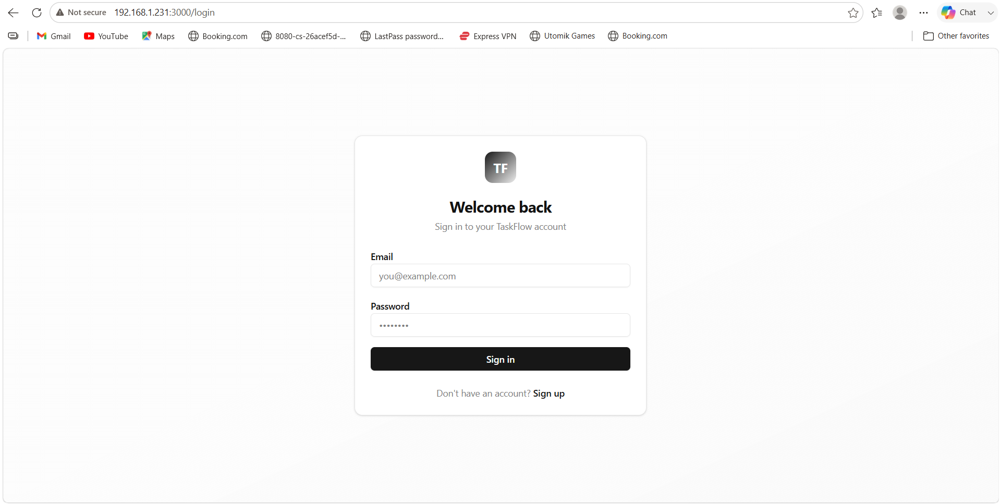

# 🚀 TaskFlow - Multi-User Task Management System

A lightweight, self-hostable task collaboration tool for remote teams. Built as a mini-Trello alternative — real-time boards, drag-and-drop cards, and role-based permissions, without the bloat or cost of larger tools.

---

## 📋 Problem Statement

Remote teams lack a lightweight, self-hostable task collaboration tool. Most existing tools are either too bloated or too expensive for small teams. TaskFlow solves this with a simple, fast, self-hostable kanban board.

---

## ✨ Features

- 🔐 **Authentication** — Register and log in via PocketBase (token-based auth)
- 📋 **Boards & Columns** — Boards contain To Do / In Progress / Done columns
- 🖱️ **Drag-and-Drop** — Move task cards between columns
- 📝 **Task Details** — Title, description, assignee, due date, and priority (Low / Medium / High)
- 💬 **Comments** — Discuss tasks directly on the card
- 🌐 **Real-time Sync** — PocketBase WebSocket subscriptions update both users' boards instantly, no refresh needed
- 👥 **Role-Based Access** — Admins can manage all cards; Members can only manage cards assigned to them
- 📊 **Dashboard** — Live stats: total tasks, completed tasks, completion rate

---

## 🛠️ Tech Stack

**Frontend**
- React 18 + Vite
- Tailwind CSS
- shadcn/ui components
- React Router
- date-fns

**Backend**
- PocketBase (self-hosted backend + database + real-time engine)
- WebSocket subscriptions for live updates

---

## 👥 Roles & Permissions

| Action | Admin | Member |
|---|---|---|
| Create boards/tasks | ✅ | ✅ |
| Edit/delete own tasks | ✅ | ✅ |
| Edit/delete any task | ✅ | ❌ |
| View dashboard | ✅ | ✅ |

---

## 🚀 Getting Started (Local Setup)

### Prerequisites
- Node.js (v18+)
- PocketBase binary ([download here](https://pocketbase.io/docs/))

### 1. Clone the repo
```bash
git clone [YOUR_REPO_URL]
cd scrum-taskboard
```

### 2. Start PocketBase
```bash
cd pocketbase
./pocketbase serve
```
PocketBase admin UI will be available at `http://127.0.0.1:8090/_/`

### 3. Start the frontend
```bash
cd apps/web
npm install
npm run dev
```
App will be available at `http://localhost:5173`

### 4. Environment setup
Update `apps/web/src/lib/pocketbaseClient.js` with your PocketBase URL if different from the default local instance.

---

## 🌐 Live Demo

- **App:** [LIVE_VERCEL_URL_HERE]
- **PocketBase backend:** [LIVE_POCKETHOST_URL_HERE]

**Demo credentials:**
- Admin: `admin@taskflow.com` / `[password]`
- Member: `[email]` / `[password]`

---

## 📸 Screenshots





---

## 🗄️ Database Structure (PocketBase Collections)

- **users** — id, email, name, avatar, role (admin/member)
- **boards** — id, name, owner, members
- **tasks** — id, title, description, board, status, priority, assignee, due_date
- **comments** — id, task, user, content, created
- **activity_logs** — id, board, user, action, created

---

## 📌 Project Status

Built as a course/portfolio project demonstrating multi-user auth, real-time sync, drag-and-drop kanban boards, and role-based permissions on a free-tier deployable stack.